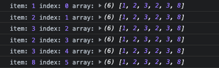

# 陣列去重

## 什麼是 陣列去重 ？

`陣列去重` 就是將陣列中`重複`的部分移除，每個元素只出現一次

```js =
[9,1,2,2,3,4,2,4,8,1,9] 

=> [9,1,2,3,4,8]
```

## 實作 陣列去重

常見的方法有四種:

1. 使用 Set

```js


function removeDuplicate(arr) {
  return Array.from(new Set(arr));
}

// 或是可以使用 spread syntax
function removeDuplicate(arr) {
  return [...new Set(arr)];
}

removeDuplicate(arr)
```

2. filter 搭配 indexOf

```js
const arr = [9,1,2,2,3,4,2,4,8,1,9]

function removeDuplicate(arr) {
    // indexOf 會回傳在這個 array 等同於此值第一個 item 的 index，
    // 所以如果 indexOf 回傳的 index 相等於目前 filter 到的值，
    // 則代表該值是第一次出現，我們保留起來，
    // 反之，如果 index 不等於，則代表此 array 中前面位置已經出現過，所以就 filter 掉。
  return arr.filter((item, index, array) => array.indexOf(item) === index);
}

removeDuplicate(arr);
```

這邊稍微講一下 `filter` 的三個參數 `(item, index, array)`

以 [MDN](https://developer.mozilla.org/zh-TW/docs/Web/JavaScript/Reference/Global_Objects/Array/filter) 的解釋是說: 

- 元素值
- 元素之索引
- 被迭代的陣列物件

不過這樣講太文謅謅了，我們直接把他 console.log 出來



可以看到 array 其實就是我們完整的 `arr`

3. 使用 reduce 和 includes

```js
let arr = [1, 2, 3, 3, 4, 4, 5];
let newArr = arr.reduce((prev, cur) => {
  return prev.includes(cur) ? prev : [...prev, cur];
}, []);
console.log(newArr); // [1, 2, 3, 4, 5]
```

4. 雙層 for loop

雙層 for loop 是一種暴力解。依序遍歷整個 array，再透過第二層 for loop 找出重複的值將其移除

BIGO 是 n^2，沒事不要用

```js
function removeDuplicate(arr) {
  // 第一層 for loop，i 從 index 0 開始，到 arr 最後
  for (let i = 0, len = arr.length; i < len; i++) {
    // 第二層 for loop，j 從 i + 1 開始，要檢查值是否重複
    for (let j = i + 1; j < len; j++) {
      // 如果值重複，則透過 splice 方法將 j 位置的值從 arr 去除
      if (arr[i] == arr[j]) {
        arr.splice(j, 1);
        // 移除重複的值之後，arr length 長度會需要減 1
        len--;
        // j 位置的值被移除，因此 j index 也要減 1
        j--;
      }
    }
  }
  return arr;
}

let arr = [1, 2, 3, 2, 3, 8];
let arrAfter = removeDuplicate(arr);

console.log(arrAfter); // [1, 2, 3, 8]
```

4. 透過 object 或 Map 儲存以遍歷過的項目

```js
function removeDuplicate(arr) {
  let seen = {};
  let newArray = [];

  // 遍歷過原本的陣列
  for (let item of arr) {
    // 判斷當前被遍歷到的項目是否已經放入過
    if (seen[item] !== true) {
      newArray.push(item); // 如果還沒，則放入要被輸出的新陣列
      seen[item] = true; // 這時紀錄一下這個項目已經被放入，下次就不會再被放入
    }
  }
  return newArray;
}

let arr = [1, 2, 3, 2, 3, 8];
let arrAfter = removeDuplicate(arr);

console.log(arrAfter); // [1, 2, 3, 8]
```


## 參考文章

[請分享你知道的陣列去除重複 (remove duplicates) 方法](https://www.explainthis.io/zh-hant/interview-guides/javascript-whiteboard/remove-duplicates)

chatGPT
